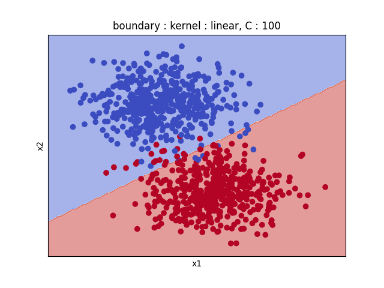
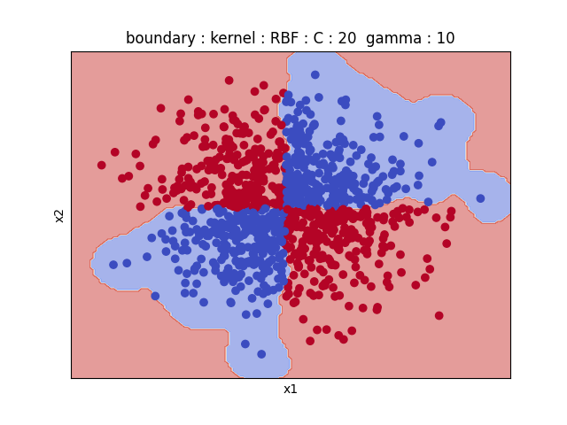
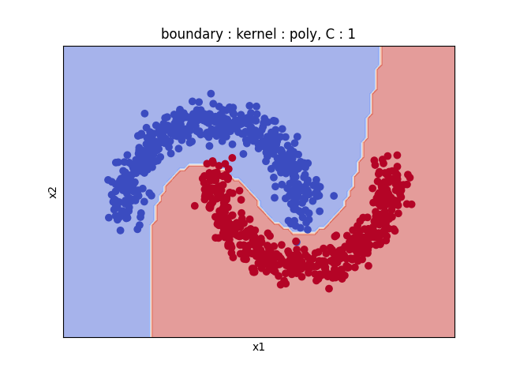
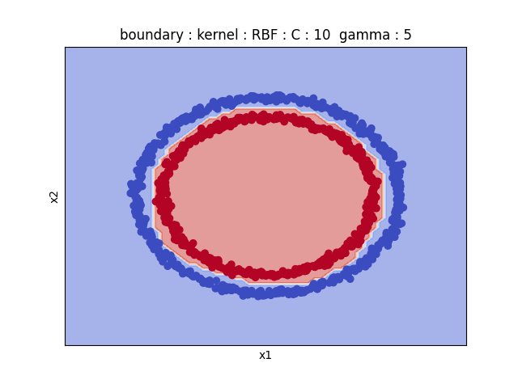

# SVM_smo_solver

Soft Margin SVM implementation, solving the dual problem thanks to the SMO-type optimization.
Implementation from scratch of the solution described in the [LIBSVM publication](https://www.csie.ntu.edu.tw/~cjlin/papers/libsvm.pdf),Chang and Lin
        .              |           .  
:---------------------------------------:|:-------------------------:
 |   
 |  
