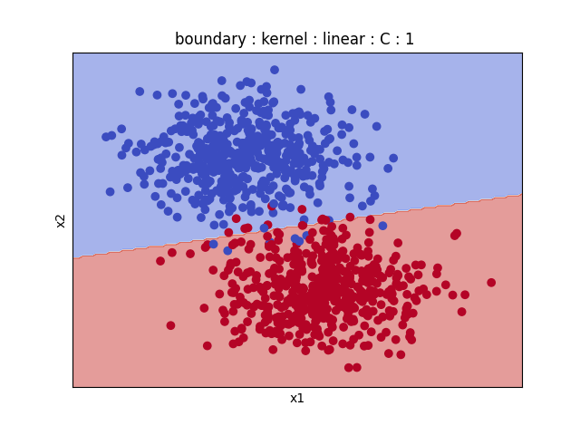
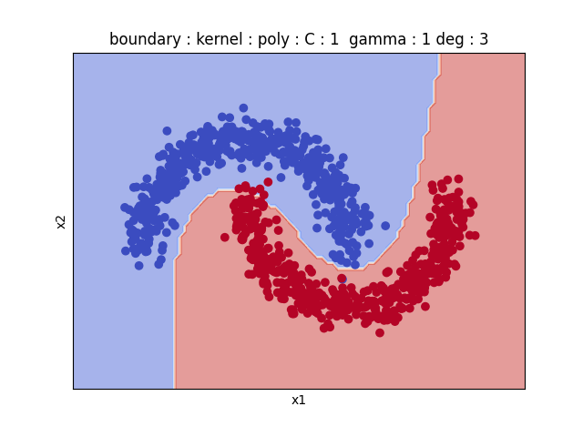

# SVM_smo_solver

Soft Margin Support Vector Machine for binary classification (SVM, or C-SVC) implementation, solving the dual problem with to the SMO-type optimization.
Implementation from scratch of the solution described in the [LIBSVM publication](https://www.csie.ntu.edu.tw/~cjlin/papers/libsvm.pdf),Chang and Lin
using the Working set selection (WSS 3) described in this [publication](https://www.csie.ntu.edu.tw/~cjlin/papers/quadworkset.pdf),Rong-En Fan et al
        .              |           .  
:---------------------------------------:|:-------------------------:
 |   
 |  
